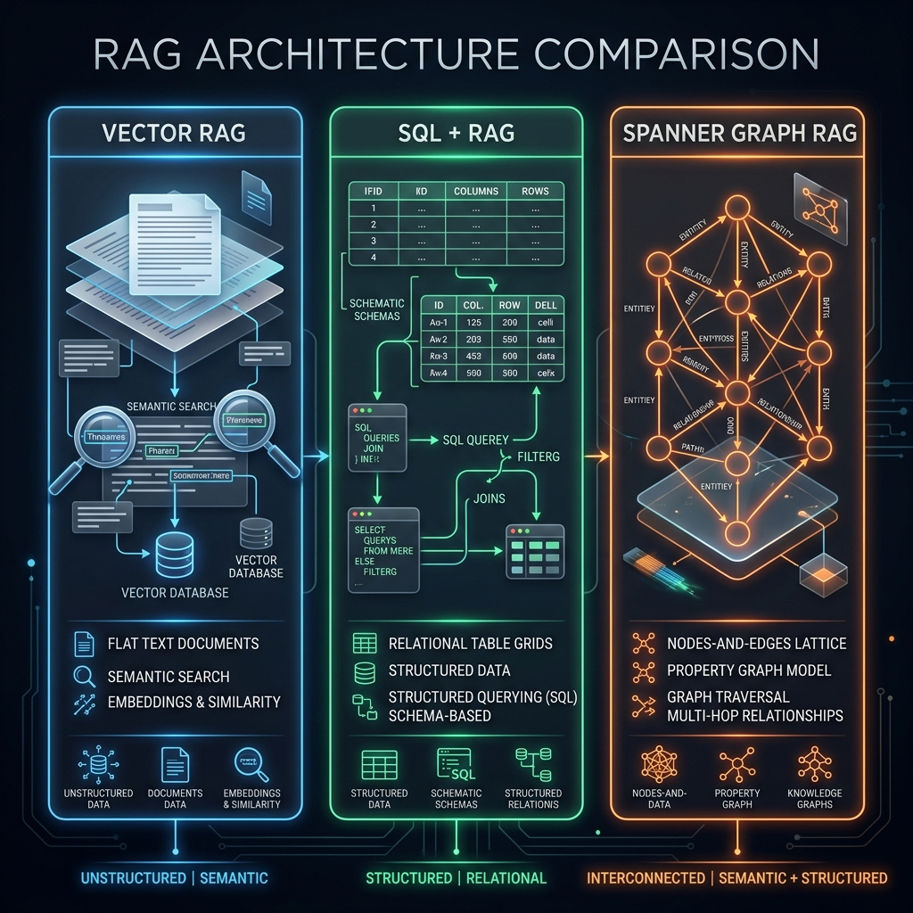
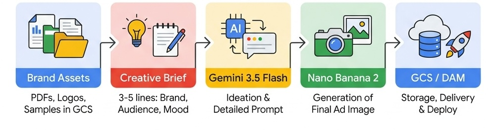
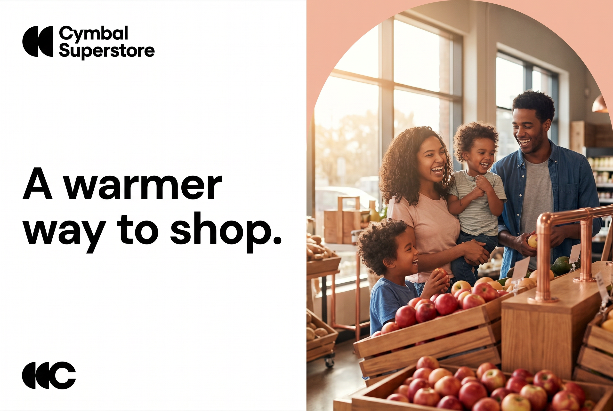
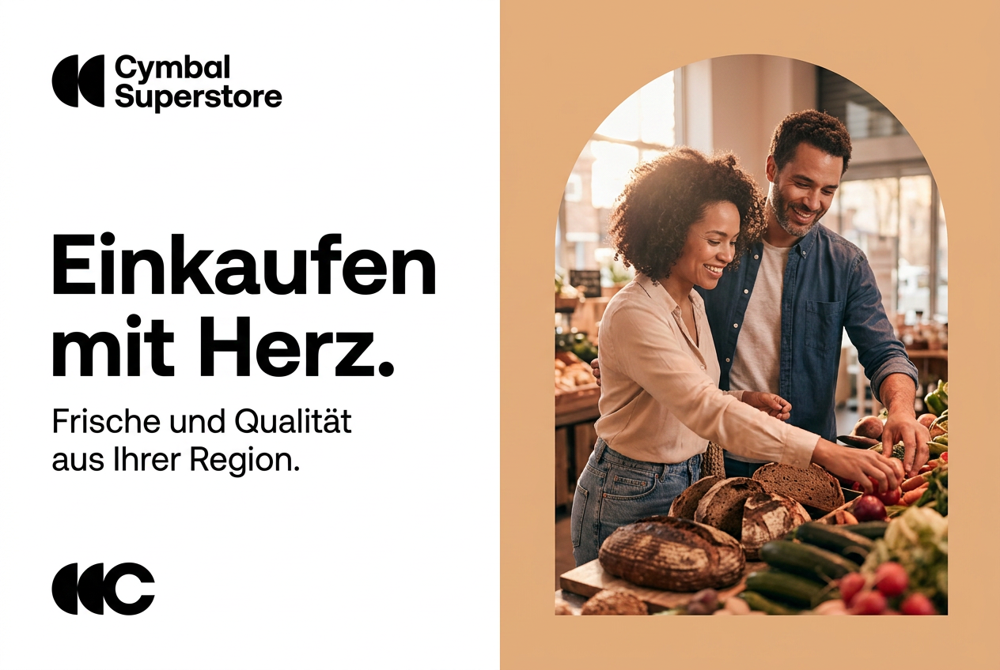

# ☁️ Google Cloud DACH AI Summit 2026 — Frankfurt
## Hands-On Lab Materials

[](https://opensource.org/licenses/Apache-2.0)
[](https://cloud.google.com)
[](https://cloud.withgoogle.com/summits/dach)

This repository contains the official hands-on lab materials for the **Google Cloud DACH AI Summit (Frankfurt, 2026)**. It includes two complete, self-contained sessions showcasing cutting-edge Google Cloud AI capabilities.

---

## 🗂️ Sessions at a Glance

| | Session 1: Graph RAG | Session 2: GenMedia Brand Campaigns |
|---|---|---|
| **Title** | Production Graph RAG for the Enterprise | From Prompt to Campaign: Building the Next Generation of Brand Storytelling |
| **Notebook** | [`production_graphrag_enterprise.ipynb`](notebooks/production_graphrag_enterprise.ipynb) | [`cymbal_brand_campaigns.ipynb`](notebooks/cymbal_brand_campaigns.ipynb) |
| **Key Models** | Gemini 3.5 Flash, `gemini-embedding-2` | Nano Banana 2 (`gemini-3.1-flash-image-preview`), Gemini 3.5 Flash |
| **Key Services** | Cloud Spanner (Graph), Vertex AI | Vertex AI, Google Cloud Storage |
| **Scenario** | Trace an E. coli outbreak through a multi-hop supply chain | Generate brand-adherent ad campaigns at scale across subsidiaries and markets |
| **You'll Learn** | Vector RAG vs. SQL+RAG vs. Spanner Graph RAG | Multimodal brand context, two-stage prompt chaining, campaign localization |

---

## 📊 Session 1: Production Graph RAG for the Enterprise

**Vector RAG vs. SQL+RAG vs. Spanner Graph RAG: A Food Safety Supply Chain Showdown**

### 🚨 The Monday Morning Crisis

> **Time:** Monday, March 4th, 2026. 8:47 AM.
> **Location:** Frankfurt am Main, Germany.
> **Trigger:** The *Gesundheitsamt Frankfurt* (public health authority) calls. *E. coli O157:H7* has been confirmed in romaine lettuce from Farm "Grünfeld Hof", Batch `#L-2024-0312` (shipped March 3rd).
> **The Mission:** Trace which restaurants and supermarkets in Frankfurt received this batch, determine consumer exposure, identify a compromised warehouse with a refrigeration failure, and compile a regulatory audit trail. **You have 2 hours before a public panic.**

### The Supply Chain Topology
```
Farm "Grünfeld Hof" (Hessen)
  → Batch #L-2024-0312 (120kg romaine lettuce, shipped 2024-03-03)
    → Distributor "FreshLog GmbH" (received 2024-03-04)
      ├→ Warehouse "Lager West" ⚠️ REFRIGERATION FAILURE Mar 3-4 overnight
      │   ├→ REWE Konstablerwache (40kg, delivered Mar 5)
      │   ├→ EDEKA Sachsenhausen (25kg, delivered Mar 5)
      │   ├→ Restaurant Margarete (8kg, delivered Mar 4)
      │   └→ Seven Swans (5kg, delivered Mar 5)
      └→ [also handled Tomatoes batch T-2024-0455 through same warehouse]
    → Distributor "BioFrisch AG" (received 2024-03-04)
      └→ Alnatura Bockenheim (15kg, delivered Mar 6) → NOT YET SOLD ✅
```

### ⚔️ The 3 RAG Architectures

The notebook implements and evaluates three architectures on the exact same dataset to answer seven escalating crisis questions:

| Architecture | Data Model | Query Method | Best For |
|:---|:---|:---|:---|
| **Vector RAG** | In-Memory / Vector Store | Semantic similarity (`gemini-embedding-2`) | Unstructured knowledge bases, FAQs |
| **SQL + RAG** | Relational (Spanner) | Gemini Text-to-SQL | Flat queries, transactional lookups |
| **Spanner Graph RAG** | Property Graph (Spanner Graph) | GQL + Gemini Graph RAG Agent | Multi-hop paths, bi-temporal audits |

### 📈 Comparison Scorecard

| # | Crisis Question | Vector RAG | SQL + RAG | Spanner Graph RAG |
|:---|:---|:---:|:---:|:---:|
| **Q1** | Direct Retailer Tracing | ⚠️ *Unreliable* | ✅ *Success* | ✅ **Perfect** |
| **Q2** | Deep Supply Chain Traversal | ❌ *Fails* | ⚠️ *Complex Joins* | ✅ **Perfect** |
| **Q3** | Warehouse Temporal Filtering | ❌ *Fails* | ✅ *Success* | ✅ **Perfect** |
| **Q4** | Lateral Pivot (Blast Radius) | ❌ *Fails* | ⚠️ *SQL Nightmares* | ✅ **Perfect** |
| **Q5** | Multi-Hop Common Source | ❌ *Fails* | ❌ *Fails* | ✅ **Perfect** |
| **Q6** | Regulatory Audit Trail | ❌ *Fails* | ⚠️ *Text Output* | ✅ **Perfect** |
| **Q7** | Bi-Temporal Compliance | ❌ *Fails* | ❌ *Fails* | ✅ **Perfect** |

### RAG Architectures Comparison



---

## 🎨 Session 2: From Prompt to Campaign — GenMedia Brand Storytelling

**Building a brand-adherent content generation pipeline with Nano Banana 2 and Gemini 3.5 Flash**

### 🎯 The Challenge

Cymbal's marketing team needs to produce on-brand digital ad campaigns across 9 subsidiaries and 50+ markets — fast. Traditional agency workflows take months. You will build a **generative media pipeline** that reduces campaign creation from weeks to minutes while maintaining strict brand compliance.

### The Pipeline

The session builds a complete **three-stage pipeline**:

| Stage | What Happens | Model |
|-------|-------------|-------|
| **1. Brand DNA Ingestion** | Upload PDFs, logos, and design samples to GCS as multimodal brand context | — |
| **2. Guided Generation** | Hand-crafted spatial layout prompts → brand-adherent campaign images | Nano Banana 2 |
| **3. LLM-Assisted Ideation** | One-line briefs → detailed prompts → campaign images (at scale) | Gemini 3.5 Flash + Nano Banana 2 |



### Campaign Examples

Generated campaign ads produced during the lab:

<table>
<tr>
<td align="center"><b>🛒 Cymbal Superstore</b><br/><i>"A warmer way to shop."</i></td>
<td align="center"><b>🏦 Cymbal Bank</b><br/><i>LLM-assisted ideation</i></td>
</tr>
<tr>
<td></td>
<td></td>
</tr>
<tr>
<td align="center"><b>💊 Cymbal Health</b><br/><i>"Your health, our heartbeat."</i></td>
<td align="center"><b>🌍 Localized (German)</b><br/><i>DACH market adaptation</i></td>
</tr>
<tr>
<td></td>
<td></td>
</tr>
</table>

### 📚 Key Takeaways

1. **Brand guidelines are your most valuable AI input.** The richer your brand DNA, the better the output.
2. **Two-stage pipelines unlock scale.** LLM ideation + image generation = hundreds of on-brand campaigns from simple briefs.
3. **Localization is a prompt transformation.** Cultural adaptation becomes minutes, not months.
4. **Human judgment stays central.** Generative media accelerates drafts; humans validate and refine.

---

## 🚀 Setup & Execution

### Option A: Colab Enterprise (Recommended for Summit participants)

Both notebooks are optimized for **Vertex AI Colab Enterprise**:

1. Upload the `.ipynb` file to Colab Enterprise (or use the Qwiklabs download link).
2. Connect to the pre-provisioned runtime in `europe-west3`.
3. Follow the step-by-step instructions in the notebook.

### Option B: Local Jupyter Environment

#### 1. Prerequisites
```bash
# Verify gcloud CLI
gcloud --version

# Authenticate
gcloud auth application-default login
```

#### 2. Clone & Install
```bash
git clone git@github.com:salekh/cloud-summit-dach-2026.git
cd cloud-summit-dach-2026

python3 -m venv .venv
source .venv/bin/activate
```

#### 3. Session 1 — Graph RAG
```bash
pip install -q google-cloud-spanner google-cloud-aiplatform google-cloud-storage \
  plotly pyvis networkx "google-genai[pyopenssl]>=2.4.0" langchain-google-spanner

jupyter notebook notebooks/production_graphrag_enterprise.ipynb
```

#### 4. Session 2 — GenMedia
```bash
pip install -q google-genai google-cloud-storage Pillow

jupyter notebook notebooks/cymbal_brand_campaigns.ipynb
```

---

## 📂 Repository Structure

```
cloud-summit-dach-2026/
├── notebooks/
│   ├── production_graphrag_enterprise.ipynb   # Session 1: Graph RAG
│   └── cymbal_brand_campaigns.ipynb           # Session 2: GenMedia
├── infographics/                              # Visual diagrams for lab instructions
│   ├── rag_comparison_infographic.png
│   ├── campaign_pipeline_infographic.png
│   ├── layout_50_50_infographic.png
│   ├── pipeline_architecture_infographic.jpeg
│   └── ...
├── ingredients/                               # Brand design assets (Cymbal)
│   └── cymbal-design/
├── outputs/                                   # Example generated campaign images
│   ├── campaign_superstore_original.png
│   ├── campaign_bank.png
│   ├── campaign_health.png
│   └── campaign_superstore_de.png
├── LICENSE
└── README.md
```

---

## 📝 License

This project is licensed under the Apache License 2.0 — see the [LICENSE](LICENSE) file for details.

*Copyright 2026 Google LLC. This is not an official Google product. It is a technical demonstration developed for the Google Cloud DACH AI Summit.*
